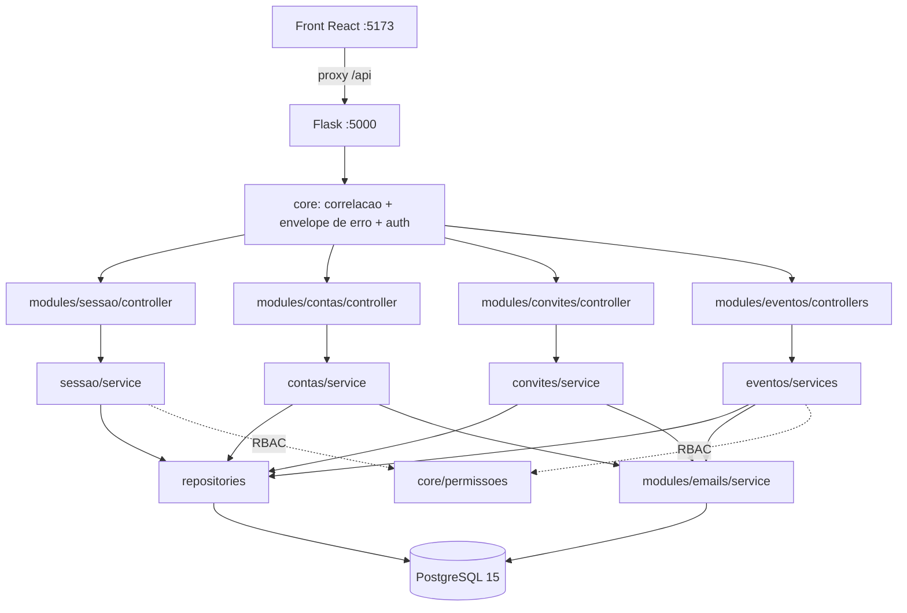

# API REST — plataforma-base e eventos-e-chamadas · Design

**Spec**: `.specs/features/api-base-e-eventos/spec.md`
**Status**: Draft

---

## Architecture Overview

Flask com **módulos por domínio**, mantendo as quatro camadas que o código existente já estabelece
(controller → service → repository → model), agora agrupadas por domínio em vez de por camada. A
borda HTTP é uniforme: todo controller valida entrada com um schema Pydantic, delega ao service e
serializa a saída com outro schema; nenhum controller monta JSON à mão e nenhum service conhece
`request` ou `Response`.



**Fluxo de uma requisição autenticada**: `before_request` gera a correlação → decorator de
autenticação resolve o `Bearer` em `Usuario` (checando `ativo` a cada requisição) → decorator de
autorização resolve os papéis do usuário **naquele evento** e consulta a matriz → controller valida
o corpo com Pydantic → service executa dentro de uma transação → controller serializa → o handler
central captura qualquer exceção e aplica o envelope.

### Alternativas consideradas

| Abordagem | Por que não |
| --------- | ----------- |
| Manter camadas planas (`controllers/`, `services/`, …) | Menor mudança hoje, mas com 8 áreas cada pasta vira uma lista de 8+ arquivos e nada de um domínio fica junto. Descartada pelo responsável |
| Módulos por domínio **sem** camada de repositório | Menos indireção — a camada de repositório sobre um ORM costuma ser redundante. Descartada para não abandonar o padrão que o outro desenvolvedor estabeleceu |
| Sessões opacas em banco no lugar de JWT | Revogação imediata de graça, mas consulta ao banco por requisição e foge do Bearer que o contrato descreve |

---

## Code Reuse Analysis

### O que aproveitamos do que já existe

| Componente | Localização | Como usar |
| ---------- | ----------- | --------- |
| Padrão de 4 camadas | `app/controllers`, `app/services`, `app/repositories`, `app/models` | **Preservado**, reorganizado por domínio. Nomes de camada mantidos para o time não reaprender nada |
| `AuthService.authenticate_user` | `app/services/auth_service.py:24` | Lógica reaproveitada em `sessao/service.py`; ganha as checagens de `email_confirmado` e a distinção 401/403 que faltam |
| `bcrypt` de `extensions.py` | `app/extensions.py:5` | Mantido como está — a escolha de hash não muda |
| `db` (Flask-SQLAlchemy) | `app/extensions.py:4` | Mantido; ganha Flask-Migrate ao lado |
| `get_required_env` | `app/config.py:3` | Padrão reaproveitado e ampliado para cobrir API-21 AC4 (falhar no boot nomeando a variável) |
| Modelo `Usuario` | `app/models/user.py` | Colunas preservadas; PK migra de `BigInteger` para `UUID` e `to_dict()` sai (substituído por schema Pydantic) |
| `docker-compose.yml` / `Dockerfile` | raiz | Mantidos; `init-scripts` sai e entra a aplicação de migrations no boot |

### Do repositório do front (referência, não dependência)

| Artefato | Localização | Como usar |
| -------- | ----------- | --------- |
| Matriz de permissões | `app/src/shared/auth/permissoes.ts` | **Portada para `app/core/permissoes.py`**, tabela por tabela. É a mesma §3.7 do documento V2; duas implementações da mesma matriz precisam ser lidas lado a lado |
| Handlers MSW | `app/src/mocks/handlers/*.ts` | Fonte dos códigos de status, nomes de `codigo` e mensagens em pt-BR |
| Tipos de domínio | `app/src/features/*/tipos.ts` | Fonte dos nomes e da opcionalidade de cada campo dos schemas Pydantic de saída |

### Pontos de integração

| Sistema | Método |
| ------- | ------ |
| Front em desenvolvimento | `server.proxy['/api'] → http://localhost:5000` no `vite.config.ts` (AD-011) |
| PostgreSQL 15 | Serviço `db` do compose; `sgs` para desenvolvimento e `sgs_test` para a suíte |
| Entrega de e-mail | `EmailService` com backend selecionado por `EMAIL_BACKEND` (`log` \| `smtp`) |

---

## Components

### `app/core/erros.py`

- **Purpose**: Definir a hierarquia de erros de domínio e traduzir tudo o que sobe para o envelope
  `{ codigo, mensagem, campos?, correlacao, ... }`.
- **Location**: `app/core/erros.py`
- **Interfaces**:
  - `class ErroDaApi(Exception)` — `codigo: str`, `status: int`, `mensagem: str`, `extras: dict`
  - `ErroDeValidacao(campos: dict[str, str])` → 422 `dados_invalidos`
  - `NaoAutenticado()` → 401 · `SemPermissao()` → 403 · `NaoEncontrado(codigo)` → 404
  - `Conflito(codigo, mensagem, **extras)` → 409 · `ConflitoDeVersao(atual: dict)` → 409 com `atual`
  - `registrar_tratadores(app)` — liga os handlers de `ErroDaApi`, `ValidationError` do Pydantic,
    `HTTPException` do Werkzeug e `Exception`
- **Dependencies**: Flask, Pydantic
- **Reuses**: nada — substitui os `jsonify({"error": ...})` espalhados pelo controller atual

### `app/core/correlacao.py`

- **Purpose**: Um identificador por requisição, em log, no header e no corpo de erro (API-01 AC3).
- **Interfaces**: `iniciar_correlacao()` (`before_request`), `correlacao_atual() -> str`,
  `anexar_correlacao(resposta)` (`after_request`)
- **Dependencies**: Flask `g`

### `app/core/schemas.py`

- **Purpose**: Base Pydantic comum a todo schema: alias camelCase automático, serialização de
  `UUID` como string e de `datetime` em ISO-8601 UTC.
- **Interfaces**: `class SchemaDaApi(BaseModel)` com `alias_generator=to_camel`,
  `populate_by_name=True`; `class SchemaDeEntrada(SchemaDaApi)` com `extra='forbid'`
- **Rationale**: garante API-01 AC4 em um lugar só, em vez de campo a campo

### `app/core/permissoes.py`

- **Purpose**: A matriz da §3.7 como tabela auditável, espelhando `permissoes.ts` do front.
- **Interfaces**:
  - `Acao` (enum), `Papel` (enum)
  - `pode(acao, papeis, eh_administrador) -> bool`
  - `@exige_autenticacao` — resolve o `Bearer`, carrega o usuário, 401 se ausente/inválido/inativo
  - `@exige_acao(acao, evento_de=...)` — resolve o evento pelo parâmetro de rota indicado, carrega
    os papéis ativos do usuário nele e aplica `pode()`; 403 quando falha
- **Dependencies**: `modules/eventos/repository` (participações)
- **Reuses**: `app/src/shared/auth/permissoes.ts` do front, tabela por tabela

### `app/core/unidade_de_trabalho.py`

- **Purpose**: Uma transação por requisição, com commit único no fim.
- **Interfaces**: context manager `transacao()`; `db.session.commit()` acontece **só** aqui
- **Rationale**: resolve o risco R5 abaixo e é pré-requisito de API-13 AC4 (aprovação atômica)

### `app/modules/contas/`

- **Purpose**: Cadastro, confirmação de e-mail e leitura da própria identidade.
- **Files**: `controller.py`, `service.py`, `repository.py`, `models.py`, `schemas.py`
- **Interfaces**:
  - `POST /api/usuarios` · `POST /api/auth/confirmar-email` · `POST /api/auth/reenviar-confirmacao`
  - `GET /api/me`
  - `ContaService.criar(dados) -> Usuario` · `.confirmar_email(token) -> str`
  - `.reenviar_confirmacao(email) -> int` (segundos de espera)
- **Dependencies**: `emails`, `core`
- **Reuses**: `AuthService.register_user` (validação de e-mail duplicado) e o modelo `Usuario`

### `app/modules/sessao/`

- **Purpose**: Login, renovação com rotação, logout, e o limite de tentativas.
- **Interfaces**:
  - `POST /api/auth/login` · `/refresh` · `/logout`
  - `SessaoService.autenticar(email, senha) -> (Usuario, TokenDeAcesso, TokenDeRenovacao)`
  - `.renovar(token_renovacao) -> (TokenDeAcesso, TokenDeRenovacao)` — rotaciona e detecta reuso
  - `.encerrar(token_renovacao) -> None` — idempotente
- **Dependencies**: `flask-jwt-extended`, `bcrypt`, `core`
- **Reuses**: `AuthService.authenticate_user`

### `app/modules/convites/`

- **Purpose**: Consulta e aceite de convite por token, sem sessão.
- **Interfaces**:
  - `GET /api/convites/{token}` · `POST /api/convites/{token}/aceitar`
  - `ConviteService.consultar(token) -> Convite` · `.aceitar(token, nome, senha) -> (Usuario, ...)`
  - `ConviteService.criar_para_participacao(evento, email, papel) -> Convite` — usado por `eventos`
- **Dependencies**: `contas`, `emails`, `core`

### `app/modules/eventos/`

- **Purpose**: Todo o EVT. Único módulo com vários controllers, um por recurso.
- **Files**: `controllers/{solicitacoes,eventos,trilhas,chamadas,criterios,publicacao,vitrine}.py`,
  `services/…`, `repository.py`, `models.py`, `schemas.py`
- **Interfaces principais**:
  - `SolicitacaoService.criar/editar/listar_minhas` · `.aprovar(id, admin)` · `.recusar(id, admin, motivo)`
  - `EventoService.obter/por_identificador/atualizar/descendentes`
  - `TrilhaService`, `ChamadaService` (+`prorrogar`, `encerrar`), `CriterioService`
  - `PublicacaoService.checklist(evento) -> Checklist` · `.publicar(evento, versao)`
  - `VitrineService.publicos()` · `.do_usuario(usuario)`
- **Dependencies**: `convites` (AD-009), `emails`, `core`

### `app/modules/emails/`

- **Purpose**: Entregar e-mail com backend trocável e registrar toda tentativa.
- **Interfaces**:
  - `EmailService.enviar(destinatario, assunto, corpo) -> EmailEnviado` — nunca levanta exceção
    para o chamador; falha vira registro com `situacao='falha'` (API-10 AC2)
  - Backends: `BackendDeLog` (grava e loga) e `BackendSmtp`
- **Rationale**: o backend é escolhido no boot; configuração SMTP incompleta falha o boot em vez
  de cair silenciosamente no log (API-10 AC4)

### `app/cli.py`

- **Purpose**: `flask seed` — administrador, usuários de exemplo e um evento aprovado com trilha,
  chamada e critérios, equivalente ao seed do MSW.
- **Guard**: recusa executar quando `APP_ENV == 'production'`

---

## Data Models

Nomes de tabela e coluna em **pt-BR snake_case** (segue o schema existente e o documento V2); a
serialização camelCase acontece só nos schemas Pydantic. Toda PK é `UUID DEFAULT uuid_generate_v4()`.

### Núcleo de contas e sessão

```
usuarios
  id UUID PK · nome VARCHAR(200) NOT NULL · email VARCHAR(255) UNIQUE NOT NULL
  email_confirmado BOOL DEFAULT FALSE · senha_hash VARCHAR(255) NOT NULL
  instituicao VARCHAR(200) · pais VARCHAR(100) · identificador_orcid VARCHAR(30)
  administrador BOOL DEFAULT FALSE · ativo BOOL DEFAULT TRUE
  criado_em TIMESTAMPTZ · atualizado_em TIMESTAMPTZ

tokens_confirmacao_email
  id UUID PK · usuario_id UUID FK→usuarios ON DELETE CASCADE
  token_hash VARCHAR(64) UNIQUE NOT NULL   -- SHA-256 do token; o valor cru só viaja no e-mail
  expira_em TIMESTAMPTZ NOT NULL · usado_em TIMESTAMPTZ · criado_em TIMESTAMPTZ
  INDEX (usuario_id, criado_em DESC)       -- janela de reenvio (API-06 AC6)

sessoes
  id UUID PK · usuario_id UUID FK→usuarios ON DELETE CASCADE
  familia UUID NOT NULL                     -- todas as rotações de um mesmo login
  token_hash VARCHAR(64) UNIQUE NOT NULL
  expira_em TIMESTAMPTZ NOT NULL · rotacionado_em TIMESTAMPTZ · revogada_em TIMESTAMPTZ
  criado_em TIMESTAMPTZ
  INDEX (familia)                           -- invalidação da família em reuso (API-04 AC3)

tentativas_login
  id UUID PK · email VARCHAR(255) NOT NULL · sucesso BOOL NOT NULL · ocorrido_em TIMESTAMPTZ
  INDEX (email, ocorrido_em DESC)           -- contagem na janela de 15 min (API-20)

emails_enviados
  id UUID PK · destinatario VARCHAR(255) NOT NULL · assunto TEXT · corpo TEXT
  situacao email_situacao_enum NOT NULL     -- enviado | falha
  erro TEXT · criado_em TIMESTAMPTZ
```

### Eventos e chamadas

```
solicitacoes_evento
  id UUID PK · solicitante_id UUID FK→usuarios · situacao solicitacao_situacao_enum
  decidido_por_id UUID FK→usuarios · decidido_em TIMESTAMPTZ · motivo_recusa TEXT
  titulo VARCHAR(300) NOT NULL · sigla VARCHAR(50) · ano INT NOT NULL
  identificador_pagina VARCHAR(100) NOT NULL · tipo evento_tipo_enum
  cidade VARCHAR(120) · estado VARCHAR(120) · pais VARCHAR(100) · fuso VARCHAR(60)
  data_inicio DATE · data_termino DATE · data_publicacao DATE
  justificativa TEXT · evento_pai_id UUID FK→eventos · versao INT DEFAULT 1
  criado_em TIMESTAMPTZ
  UNIQUE (identificador_pagina)             -- + checagem cruzada contra eventos no service

solicitacao_chairs_iniciais
  id UUID PK · solicitacao_id UUID FK→solicitacoes_evento ON DELETE CASCADE
  email VARCHAR(255) NOT NULL
  UNIQUE (solicitacao_id, email)            -- API-13 AC6

eventos
  id UUID PK · solicitacao_id UUID FK→solicitacoes_evento
  situacao evento_situacao_enum · titulo · sigla · ano · identificador_pagina UNIQUE
  tipo · cidade · estado · pais · fuso · data_inicio · data_termino · data_publicacao
  site VARCHAR(300) · evento_pai_id UUID FK→eventos
  modelo_avaliacao modelo_avaliacao_enum DEFAULT 'aberta'
  avaliadores_por_submissao INT DEFAULT 1 CHECK (>= 1)
  rebuttal_habilitado BOOL DEFAULT FALSE · prazo_rebuttal_dias INT
  maximo_rodadas INT DEFAULT 1 CHECK (>= 1) · nota_corte NUMERIC(5,2)
  limite_submissoes_por_autor INT · versao INT DEFAULT 1
  criado_em · atualizado_em
  CHECK (NOT rebuttal_habilitado OR prazo_rebuttal_dias IS NOT NULL)   -- API-14 AC6 no banco

participacoes_evento
  id UUID PK · evento_id UUID FK→eventos ON DELETE CASCADE
  usuario_id UUID FK→usuarios ON DELETE CASCADE
  papel papel_enum NOT NULL · areas_interesse TEXT · ativo BOOL DEFAULT TRUE · criado_em
  UNIQUE (evento_id, usuario_id, papel)     -- preservada do schema existente

convites
  id UUID PK · token_hash VARCHAR(64) UNIQUE NOT NULL
  tipo convite_tipo_enum NOT NULL           -- avaliacao | participacao   (D3)
  email VARCHAR(255) NOT NULL · evento_id UUID FK→eventos · papel papel_enum
  submissao_id UUID                          -- NULL em convite de participacao (D3)
  prazo TIMESTAMPTZ · contato_organizacao VARCHAR(255)
  situacao convite_situacao_enum · criado_em · aceito_em
  CHECK (tipo <> 'avaliacao' OR submissao_id IS NOT NULL)

trilhas
  id UUID PK · evento_id UUID FK→eventos ON DELETE CASCADE
  nome VARCHAR(200) NOT NULL · descricao TEXT · ativa BOOL DEFAULT TRUE · criado_em
  UNIQUE (evento_id, nome)                  -- API-15 AC7

chamadas
  id UUID PK · evento_id UUID FK→eventos ON DELETE CASCADE · trilha_id UUID FK→trilhas
  titulo VARCHAR(300) · data_abertura TIMESTAMPTZ · data_limite TIMESTAMPTZ
  permite_submissao_apos_prazo BOOL DEFAULT FALSE
  formatos_aceitos JSONB DEFAULT '[]' · tamanho_maximo_mb INT
  encerrada_manualmente BOOL DEFAULT FALSE · versao INT DEFAULT 1 · criado_em
  CHECK (data_limite > data_abertura)       -- API-16 AC3 no banco

criterios_avaliacao
  id UUID PK · evento_id UUID FK→eventos ON DELETE CASCADE
  titulo VARCHAR(300) · descricao TEXT
  nota_minima NUMERIC(5,2) · nota_maxima NUMERIC(5,2) · peso NUMERIC(5,2) CHECK (peso > 0)
  ordem INT · ativo BOOL DEFAULT TRUE · criado_em
  CHECK (nota_maxima > nota_minima)
```

### Tabelas mínimas de áreas futuras (AD-007, estendida)

Existem para que quatro campos do contrato sejam **derivados de verdade** em vez de fixados. Nascem
vazias; nenhum endpoint delas é implementado nesta rodada, e as áreas donas as ampliam por migration
aditiva.

```
formularios_chamada   id UUID PK · chamada_id FK→chamadas · versao INT · status VARCHAR(20)
                      → alimenta checklist.formularioDefinido        (dona: FORM)
fases_evento          id UUID PK · evento_id FK→eventos · nome VARCHAR(200) · ordem INT
                      → alimenta checklist.etapasDefinidas           (dona: FASE)
submissoes            id UUID PK · chamada_id FK→chamadas · trilha_id FK→trilhas
                      → alimenta trilha.submissoesVinculadas         (dona: SUB)
notas_parecer         id UUID PK · criterio_id FK→criterios_avaliacao
                      → alimenta criterio.temNotas e o 409 de exclusão (dona: AVAL)
```

**Relacionamentos**: `eventos.evento_pai_id` é auto-referência (hierarquia, API-14 AC8);
`participacoes_evento` é a tabela-ponte que responde `/me/participacoes` e alimenta todo o RBAC;
`convites` aponta para evento e papel, e é o caminho de entrada de quem ainda não tem conta.

---

## Error Handling Strategy

| Cenário | Tratamento | O que o front vê |
| ------- | ---------- | ---------------- |
| Corpo reprovado por schema Pydantic | `ValidationError` → tradutor mapeia `loc` para nome camelCase | 422 `dados_invalidos` com `campos` |
| Regra de negócio violada | Service levanta subclasse de `ErroDaApi` | Status e `codigo` da própria exceção |
| `versao` divergente | `ConflitoDeVersao(atual=schema(registro))` | 409 `conflito_de_versao` com `atual` (D2) |
| Violação de unicidade no banco | `IntegrityError` mapeado por nome da constraint | 409 `email_existente` / 422 com o campo — nunca 500 |
| Token ausente ou inválido | Decorator de autenticação | 401 `nao_autenticado` |
| Papel insuficiente | Decorator de autorização, **antes** da busca do recurso | 403 `sem_permissao` (API-09 AC5) |
| Rota inexistente / método errado | `HTTPException` do Werkzeug capturada | 404/405 no envelope, nunca HTML |
| Corpo não-JSON ou maior que o limite | Handler dedicado | 400 `corpo_invalido` / 413 |
| Exceção não prevista | Handler de `Exception`: loga stack com a correlação | 500 `erro_interno`, sem stack no corpo |
| Falha do backend de e-mail | Capturada dentro de `EmailService` | Nada — a operação de negócio conclui |

---

## Risks & Concerns

| Concern | Location | Impact | Mitigation |
| ------- | -------- | ------ | ---------- |
| **R1** — Repositórios dão `commit()` a cada operação | `app/repositories/user_repository.py:16,29,34` | A aprovação de solicitação (API-13 AC4) precisa criar evento + participações + convites **atomicamente**; com commit por operação, uma falha no meio deixa estado parcial | Repositórios param de commitar; commit único em `core/unidade_de_trabalho.py`, no fim da requisição. Tarefa dedicada, antes de qualquer service novo |
| **R2** — `me()` não trata usuário inexistente | `app/controllers/auth_controller.py:44` | `user.to_dict()` com `user is None` → `AttributeError` → 500 numa sessão com id obsoleto | Substituído pelo decorator de autenticação, que devolve 401 quando o usuário não existe ou está inativo (Edge Case da spec) |
| **R3** — `Usuario.query.get()` é API do SQLAlchemy 1.x | `app/repositories/user_repository.py:10` | Depreciada no SQLAlchemy 2.0 (instalado: 2.0.52); emite aviso hoje e some numa versão futura | Migrar para `db.session.get(Usuario, id)` na reescrita do repositório |
| **R4** — `SESSION_COOKIE_SECURE = False` fixo no código | `app/config.py:16` | Comentário diz "mudar em produção" — exatamente o tipo de troca que ninguém lembra de fazer no deploy | Passa a derivar de `APP_ENV`; produção sem HTTPS falha no boot |
| **R5** — `debug=True` é o comando de produção | `run.py:6` e `Dockerfile:19` | O debugger do Werkzeug exposto permite execução de código remoto | `CMD` passa a servidor WSGI de produção; `debug` só sob `APP_ENV=development` |
| **R6** — `participacoes_evento.evento_id` sem chave estrangeira | `init-scripts/01-schema.sql:22` | Participação órfã apontando para evento inexistente, e todo o RBAC lê essa tabela | A migration inicial cria a FK. O arquivo sai por AD-005 |
| **R7** — Zero testes no repositório hoje | — | Nenhuma rede de segurança para a refatoração do auth que a rodada exige | API-22 monta a suíte **antes** da refatoração; o auth atual ganha teste de caracterização antes de ser tocado |
| **R8** — RBAC real cria 403 que o front nunca exercitou | transversal (AD-008) | Tela que o front acredita permitida pode receber 403 na integração | `core/permissoes.py` é porte tabela-a-tabela de `permissoes.ts`; um teste compara a matriz portada com a do front, campo a campo |
| **R9** — Duas implementações da mesma matriz de permissões | `core/permissoes.py` ↔ `permissoes.ts` | Divergem com o tempo e o front passa a mostrar menu para ação que a API nega | Aceito e mitigado, não eliminado: teste de paridade que falha se as tabelas divergirem. Unificar exigiria gerar uma da outra — fora de escopo |
| **R10** — Sem CORS e sem limite de tamanho de corpo | `app/__init__.py` | Corpo grande consome memória; a ausência de CORS só não dói porque o proxy resolve dev | `MAX_CONTENT_LENGTH` configurado (413); CORS fica desnecessário por AD-011 e é declarado como pendência de deploy |
| **R11** — Migrar `BIGSERIAL` → `UUID` com dados existentes | migration inicial | Bancos locais do time têm dados de teste que não sobrevivem | A migration inicial recria as tabelas; comunicar que o volume local precisa ser descartado uma vez. Aceitável agora, impossível depois de haver dado real |

---

## Tech Decisions

| Decisão | Escolha | Racional |
| ------- | ------- | -------- |
| Organização do código | Módulos por domínio, 4 camadas dentro | 8 áreas e ~100 endpoints à frente; espelha a organização por feature do front |
| JWT | `flask-jwt-extended` 4.7.4 | Emissão, verificação e mecânica de cookie httpOnly prontas; a rotação e a detecção de reuso ficam na tabela `sessoes`, que qualquer opção exigiria |
| Driver do Postgres | **Manter `psycopg2-binary` 2.9.9** | `psycopg` 3.3.5 exigiria trocar o esquema da `DATABASE_URL` (`postgresql+psycopg://`) no `.env` de todo mundo. Ganho não justifica a quebra agora |
| Armazenamento de token | Só o **SHA-256** do token de renovação, de confirmação e de convite | Vazamento do banco não entrega sessão nem convite ativo. O valor cru existe só no e-mail e no cookie |
| Formato de `formatos_aceitos` | `JSONB` | Lista curta de strings; `JSONB` evita uma tabela-ponte para um dado que nunca é consultado isoladamente |
| Validação de faixa e data | `CHECK` no banco **além** do Pydantic | O Pydantic protege a borda HTTP; o `CHECK` protege contra escrita por outro caminho (seed, migration, psql) |
| `temNotas` e `submissoesVinculadas` | Derivados de tabelas mínimas vazias | Mesmo racional de AD-007: o campo é honesto e o caminho de 409 fica testável inserindo uma linha, em vez de ser código morto |
| Serialização de data/hora | ISO-8601 UTC com `Z` | A API não decide apresentação; o front já formata no fuso do evento |
| Ordem dos decorators | Autorização **antes** de carregar o recurso | API-09 AC5: não revelar existência de recurso a quem não teria permissão |

> **Decisões de nível de projeto** desta fase — a serem anexadas ao `.specs/STATE.md`: a organização
> em módulos por domínio, o uso de `flask-jwt-extended`, a política de guardar apenas hash de
> token, e a extensão de AD-007 a `submissoes` e `notas_parecer`.
